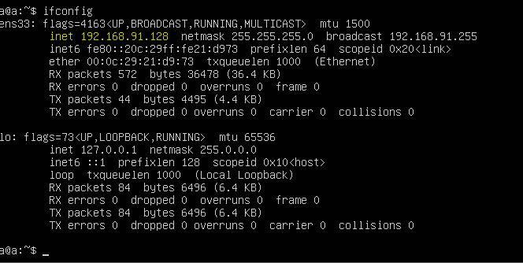
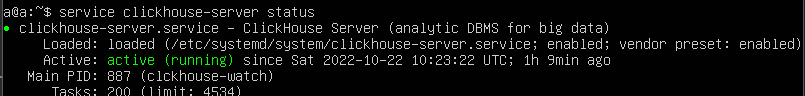

# Анализ полученных данных
# 2. Установка и настройка ClickHouse
## Виртуальная машина
Скачаем образ **Ubuntu Server** с [официального сайта](https://ubuntu.com/download/server). В качестве виртуальной машины будем использовать VMware *(я использую VMware Workstation 16 Player)*.

Процесс установки не описывается, так как ничем не отличается от постоянного нажатия *"продолжить"*. 
Моя машина называется *"а"*, в ней есть пользователь *"а"* с паролем *"а"* *~~(это очень надёжно)~~*.

В итоге имеем что-то вроде такого *(должны еще автоматически появиться сообщения о настройке SSH)*:


### После установки необходимо выполнить ряд команд
Сперва `sudo apt update` для обновления пакетов.

Далее поработаем с сертификатами и добавим публичный ключ от ClickHouse:

```
sudo apt install apt-transport-https ca-certificates dirmngr

sudo apt-key adv --keyserver keyserver.ubuntu.com --recv E0C56BD4
```
Мы почти готовы к установке CH...

```
echo "deb http://repo.yandex.ru/clickhouse/deb/stable/ main/" | sudo tee /etc/apt/sources.list.d/clickhouse.list

sudo apt update
```
Устанавливаем СН, а также запускаем службу + прописываем в автозагрузку:

```
sudo apt install clickhouse-server clickhouse-client
sudo systemctl start clickhouse-server
sudo systemctl enable clickhouse-server
```

### Теперь настроим сервер, как минимум включим возможность стучаться к нему за пределами виртуалки

Для этого сначала откроем конфиг `sudo nano /etc/clickhouse-server/config.xml`, затем найдем строчки вроде *"<tcp_port>9000</tcp_port>"* и добавим туда новую строчку `<listen_host>::</listen_host>`, где *"::"* - это адрес, с которого мы можем принимать запросы, в нашем случае это вообще все адреса.

Теперь выключим машину и проверим настройки сети:


Включим и выполним `ifconfig` *(если нам скажут, что нужно установить net-tools, то ставим)*, чтобы узнать адрес машины, будет что-то вроде:



Проверим, что сервер работает: `service clickhouse-server status`



Добавим правила в фаерволл:

```
sudo ufw enable
sudo ufw allow 8123
sudo ufw allow 8123/tcp
sudo ufw allow 9000
sudo ufw allow 9000/tcp
```

Проверить можно с помощью `sudo ufw status`.